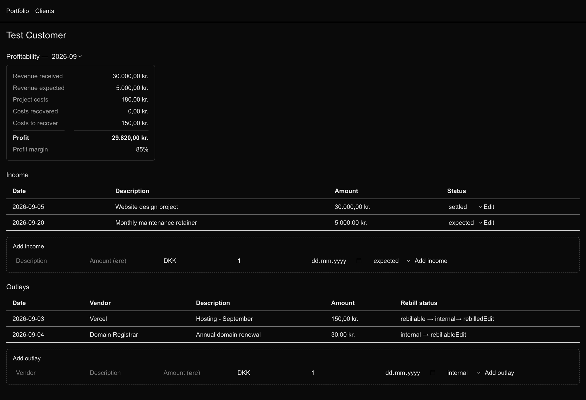
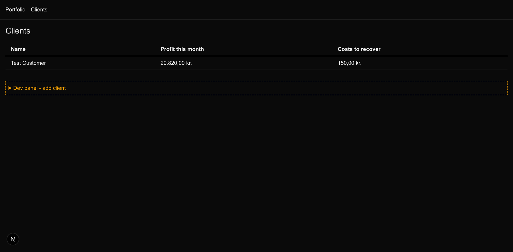
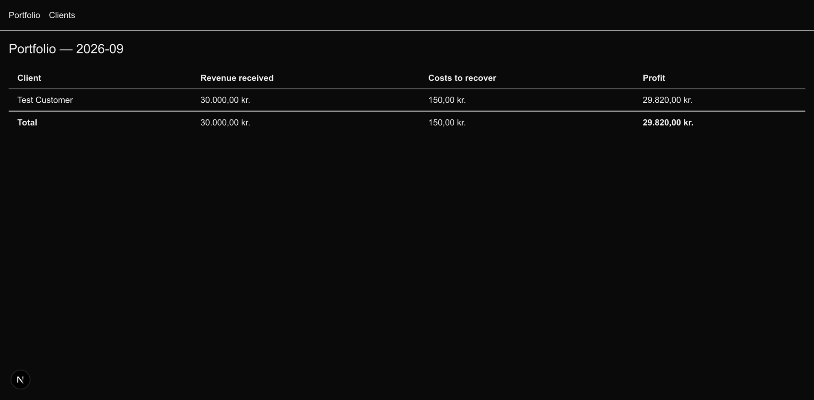

# MeBa Clients

A dashboard that answers **"which clients make us money?"** — tracking what
each client pays, what the company fronts on their behalf, and which of
those fronted costs have actually been paid back.

## Why

A spreadsheet will tell you your revenue. It won't tell you the number that
actually matters day to day: **money you've spent on a client's behalf that
you haven't gotten back yet.** That's what this tracks.

## Screenshots

**Client detail — revenue, costs, and profit for the month**



**Client list — profit and outstanding costs at a glance**



**Portfolio — every client ranked by profit**



## The model

```
organizations ──< clients ──< engagements
                                  │
                    ┌─────────────┴─────────────┐
                    │                           │
                 income                      outlays
           (what they pay us)         (what we front for them)
                    │                           │
              recurring or             rebill status:
               one-off                 internal | rebillable
                                              │
                                       rebilled_at, settled_at
```

Every outlay (a cost paid on a client's behalf — Supabase, Vercel, a
contractor, a domain renewal) carries an explicit **rebill lifecycle**:

- **internal** — the company absorbs it, never billed to the client
- **rebillable** — billed to the client, not yet paid back
- **rebilled** → **settled** — invoiced, then actually recovered

`settled` is terminal by design. Reversing a mistake (`rebilled` back to
`rebillable`) is allowed; nothing can silently un-settle.

### Terminology on screen

| Shown in the UI  | What it means                                                                       |
| ----------------- | ------------------------------------------------------------------------------------ |
| Revenue received  | Money the client has actually paid                                                   |
| Revenue expected  | Money invoiced/expected but not yet paid                                             |
| Project costs      | Total costs incurred on the client's behalf this month                               |
| Costs recovered    | Project costs the client has paid back                                               |
| Costs to recover   | Project costs fronted but not yet paid back — the number a spreadsheet won't show you |
| Profit             | Revenue received, minus internal costs and costs not yet recovered                   |
| Profit margin      | Profit as a percentage of total revenue (received + expected)                        |

## Tech stack

- **Next.js 16** (App Router) + **React 19** + **TypeScript**
- **Drizzle ORM** over **Postgres 17** (Docker)
- **Zod** for input validation at the boundary
- **Vitest** for tests
- **Tailwind 4** for base styling

## Getting started

```bash
docker compose up -d      # start Postgres on localhost:5433
cp .env.example .env.local
npm install
npx drizzle-kit push      # apply the schema
npm test                  # run the test suite
npm run dev                # http://localhost:3000
```

## Project layout

```
lib/
  money/        pure money math — integer minor units (øre), never a float
  date.ts       local-timezone date helpers (Europe/Copenhagen)
  db/           Drizzle schema and connection
  data/         tenant-scoped reads/writes — every query filters by org_id
  finance/      pure business logic — margin, rebill lifecycle, aging, portfolio
  validation/   Zod schemas at the input boundary
app/
  (dashboard)/  the actual pages — portfolio, clients, client detail
```

**Money is integer minor units (øre), never a float.** Division by 100
happens in exactly one place: `lib/money/format.ts`.

**Every data function takes an explicit org context and filters by it.**
Single-row operations match on `id` AND `org_id` together, never `id` alone
— a Postgres foreign key proves a row *exists*, not that it belongs to you.

**`lib/finance/` never imports from `lib/db/` or `lib/data/`.** The pure
business logic (margin math, the rebill state machine) has no idea a
database exists, which is what makes it fast and simple to test.

## Testing

```bash
npm test
```

All business logic — money rounding, date boundaries, the rebill state
machine, margin calculation, tenant isolation — is covered by tests that run
against a real Postgres instance, not mocks.

## Status

Feature-complete against its 14-day build plan: aging, an adversarial
security pass (cross-tenant isolation, money/date edge cases,
concurrency-safe rebill transitions), real client CRUD, a design pass,
mobile responsiveness, CSV export, recurring-income visibility, and a WCAG
AA accessibility pass are all done and tested. Populated with realistic
mock client data (real MeBa figures aren't available yet).

Solo build, single-user local use — authentication is deliberately deferred
(the org context is a parameter, not a session). See
[docs/plans/2026-09-25-day14-buffer-and-next-steps.md](docs/plans/2026-09-25-day14-buffer-and-next-steps.md)
for the current decision on auth and deployment.
